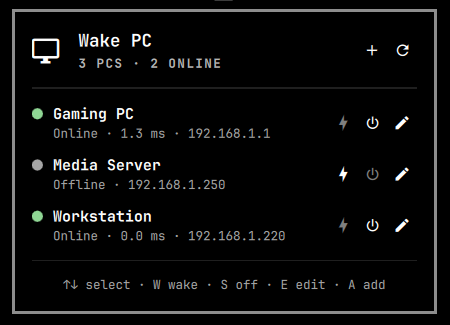
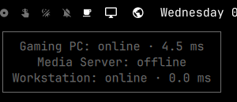
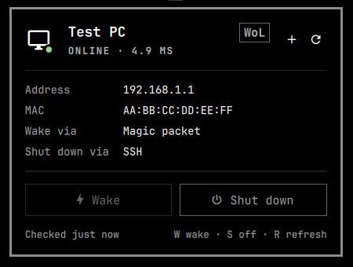
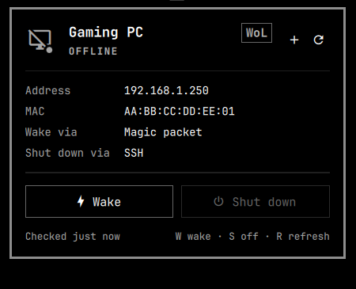
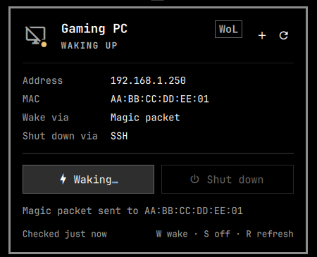
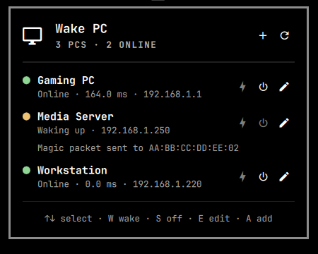

# W.O.L.P.
## Wake On LAN Plugin

A bar widget for the Omarchy shell that wakes PCs over the network, shuts them
down, and shows whether they are online. It handles one PC or many.

<p align="center">
  
</p>

## Disclaimer

*I am not a dev* ***YET***. I am very new to all of this, and am still learning. But this plugin was 100% vibe coded by Claude Opus 5.5 using an average of 20M tokens lmao.
But hopefully this will push me to make more plugins with my hand in the mix. I just had an idea that I wanted to bring into existence, and with inspiration from the omawake plugin, WOLP now exists.

## Using it

**Left-click** the bar icon to open the panel. **Right-click** refreshes the
status. The icon is dimmed and crossed out while every PC is off, and pulses
while one boots or shuts down. Hover it to see each PC's status.

| A PC is online | Every PC is off |
| :---: | :---: |
|  |  |

<p align="center">
  
</p>

### Moving the icon

The icon doesn't have to stay where it lands when you install the plugin. To
move it, hold **Super** (the Windows key, or Command on a Mac keyboard), then
click and drag the icon to wherever you want it on the top bar: the left,
center or right section, or between any of your other widgets. Let go to drop
it there. Omarchy saves the new position, so it stays put after a restart.

### One PC

With a single PC, the panel shows:

- the PC's name and a **status dot**: green when online (with the ping time),
  amber while it wakes up or shuts down, red on an error, grey when it's off
- the address, MAC address, and the wake and shutdown methods in use
- **Wake** and **Shut down** buttons. Shut down asks for confirmation inside
  the panel before doing anything
- the result of the last action, and when the status was last checked

The small **+** next to the refresh button adds another PC.

| Online | Off | Waking up |
| :---: | :---: | :---: |
|  |  |  |

### Several PCs

Once you add a second PC, the panel becomes a list: one row per PC with its
status dot, ping time and address, plus Wake, Shut down and Edit buttons.
Shutdown still asks for confirmation, inside that PC's row. Remove a PC from
its Edit form; when only one is left, the panel goes back to the single-PC view.

<p align="center">
  
</p>

### Adding and editing PCs

The **+** button (or `A`) opens a form. It only shows the fields for the wake
and shutdown methods you pick. Press `Enter` in any field, or **Add PC**, to
save.

The first PC is stored in the widget's normal settings, so you can also edit it
from Omarchy's settings page. Additional PCs are stored in the same widget
entry in `~/.config/omarchy/shell.json`, under `extraPcs`.

### Keyboard shortcuts

| Key | Action |
| --- | --- |
| `↑` `↓` / `J` `K` | Select a PC (list view) |
| `W` | Wake the selected PC |
| `S` | Shut down the selected PC (asks first) |
| `Enter` / `Y` | Confirm shutdown |
| `Esc` / `N` | Cancel shutdown, or close the panel |
| `E` | Edit the selected PC (list view) |
| `A` / `+` | Add a PC |
| `R` | Refresh all |

You also get a desktop notification when the PC comes online or goes off, so
you can close the panel and wait.

## Wake methods

| Wake method | How it wakes | How it checks status |
| --- | --- | --- |
| `magic-packet` | Sends a Wake-on-LAN magic packet over UDP | Pings `Host / IP` |
| `upsnap` | Calls the [UpSnap](https://github.com/seriousm4x/UpSnap) API | Reads the device status from UpSnap |

## Shutdown methods

Shutdown is set separately from the wake method, so you can mix them (for
example, wake with a magic packet and shut down over SSH).

| Shutdown method | What it does | Needs |
| --- | --- | --- |
| `none` | Shutdown is off (default). | — |
| `upsnap` | Runs the shutdown command set up for the device in UpSnap. | The UpSnap settings. |
| `ssh` | Runs `Shutdown command` on the PC over SSH. Default: `sudo systemctl poweroff`. | Key-based SSH login (no password prompts). |
| `windows` | Runs `net rpc shutdown` against a Windows PC. | The `samba` package, and a Windows account with a password. |
| `http` | Sends a GET or POST to `Shutdown URL`, e.g. a Home Assistant webhook. | Something listening at that URL. |
| `command` | Runs `Shutdown command` on this computer with `sh`. `$WAKE_PC_HOST` and `$WAKE_PC_MAC` are set. | Anything you like. |

**SSH to Linux.** The shutdown command must run without asking for a password.
Allow it with sudoers on the PC (`sudo visudo -f /etc/sudoers.d/poweroff`):

```
youruser ALL=(root) NOPASSWD: /usr/bin/systemctl poweroff
```

**SSH to Windows.** With the OpenSSH Server feature on, set `Shutdown command`
to `shutdown /s /t 0`.

**Windows RPC.** Remote shutdown needs the Remote Registry service running
and, on most home setups, the `LocalAccountTokenFilterPolicy` registry value
set to `1` so local accounts can use admin rights over the network. The SSH
method is often easier.

**Custom command.** Use this for anything else, for example
`curl -fsS -H @$HOME/.config/my-token-header https://...`, where
`~/.config/my-token-header` holds the line `Authorization: Bearer <token>`
and is `chmod 600`. curl reads the header from the file itself, so the token
never appears in its arguments. Avoid `$(cat file)`: the shell expands it
into the command's arguments, where other users can see it with `ps`.

## Install

```bash
omarchy plugin add https://github.com/rafaelmellopro/WOLP.git --enable --yes
```

Then click the new bar icon and choose **Add a PC**. It sits next to your
other bar widgets:

<p align="center">
  
</p>

## Requirements

- Omarchy with its Quickshell-based shell.
- `python3` (standard library only).
- `ping` for status checks in `magic-packet` mode.
- `notify-send` for notifications.
- For shutdown: `ssh` (ssh method) or `samba` (windows method).
- Wake-on-LAN enabled in the target PC's BIOS/UEFI and on its network card.

## Settings

| Setting | Used by | Description |
| --- | --- | --- |
| Name | both | Shown in the tooltip and notifications. |
| Wake method | both | `magic-packet` or `upsnap`. |
| MAC address | magic-packet | Target network card, e.g. `AA:BB:CC:DD:EE:FF`. |
| Broadcast address | magic-packet | e.g. `192.168.1.255`. Default `255.255.255.255`. |
| UDP port | magic-packet | Usually `9` or `7`. |
| Host / IP | magic-packet | Pinged to tell whether the PC is online. |
| UpSnap URL | upsnap | e.g. `https://upsnap.lan:8090`. Must be `https://` (or `http://localhost`) in the form — see [security notes](#security-notes). |
| UpSnap device ID | upsnap | The device's record ID in UpSnap. |
| UpSnap username/email | upsnap | Leave empty if the device is public. |
| UpSnap password file | upsnap | A file that contains only the password. |
| Shutdown method | both | `none`, `upsnap`, `ssh`, `windows`, `http` or `command`. |
| Shutdown host | ssh, windows | The PC's address. Leave empty to use `Host / IP`. |
| Shutdown username | ssh, windows | SSH login user, or Windows account (`DOMAIN\user` works). |
| Shutdown password file | windows | A file that contains only the Windows password. |
| Shutdown command | ssh, command | The command to run on the PC (SSH) or on this computer (command). |
| SSH port | ssh | Default `22`. |
| SSH key | ssh | Private key to use. Leave empty for your default keys. |
| Shutdown URL | http | The URL to request. Must be `https://` (or `http://localhost`) in the form — see [security notes](#security-notes). |
| Shutdown HTTP method | http | `POST` or `GET`. |
| Status poll interval | both | Seconds between status checks (5–600). |

Keep passwords in separate files that only you can read, rather than
in the settings:

```bash
printf '%s' 'your-password' > ~/.config/upsnap-password
chmod 600 ~/.config/upsnap-password
```

### Security notes

- **Settings never go on the command line.** The widget hands its settings
  to `wake-pc.py` in an environment variable, which only your own user can
  read, so shutdown URLs and commands don't show up in `ps` for other
  accounts. The custom shutdown command itself does run with its text as
  arguments, though, so anything in it — including whatever `$(cat file)`
  expands to — is visible to `ps` while it runs. Have the program read the
  secret from a private file itself, like curl's `-H @file` in the
  custom command example under [Shutdown methods](#shutdown-methods).
- **Password files must be private.** `wake-pc.py` refuses to read a password
  file that group or others can read, and shows the `chmod 600` fix in the
  panel.
- **URLs that carry secrets must use HTTPS.** The add/edit form rejects
  `http://` UpSnap and shutdown URLs (except `http://localhost`/`127.0.0.1`),
  because the UpSnap password, session token and webhook tokens travel in
  them unencrypted over plain HTTP. On a trusted LAN you can still set a
  plain-HTTP URL directly in the widget settings — that path skips the
  form's validation.
- **SSH shutdown trusts new hosts automatically**
  (`StrictHostKeyChecking=accept-new`). On a shared or untrusted network,
  connect once from a terminal first, so you can verify the host key
  yourself before the panel ever talks to the PC.

Add each PC from the panel's **+** button; one widget can manage several PCs.

## Command-line helper

The widget calls `wake-pc.py`, which you can also run directly to test your
settings. It prints one JSON line such as `{"state": "online", "detail": "..."}`.
Options given on the command line are visible to other users through `ps`,
so don't pass token-bearing URLs this way on a shared machine.

```bash
./wake-pc.py wake   --mode magic-packet --mac AA:BB:CC:DD:EE:FF --broadcast 192.168.1.255
./wake-pc.py status --mode magic-packet --host 192.168.1.50
./wake-pc.py shutdown --shutdown-method ssh --host 192.168.1.50 --shutdown-user me
./wake-pc.py status --mode upsnap --upsnap-url https://upsnap.lan:8090 --device-id abc123 \
                    --identity me@example.com --password-file ~/.config/upsnap-password
```

## Tests

The PC list logic (`Pcs.js`) has tests you can run with Node:

```bash
node tests/pcs.test.js
```

## Local development

Link this repository into the plugins folder, then rescan:

```bash
ln -s "$PWD" ~/.config/omarchy/plugins/wolp.pc
omarchy-shell shell rescanPlugins
omarchy plugin enable wolp.pc --section right
```

The shell caches compiled QML, so after editing `Panel.qml` run
`omarchy-restart-shell` to see the change. Edits to `wake-pc.py` and
`manifest.json` apply without a restart.

Open the panel from a terminal (or a keybinding) with:

```bash
omarchy-shell shell toggle wolp.pc
```

## Remove

```bash
omarchy plugin remove wolp.pc --yes
```

## Credits

The panel layout (status dots, the in-place confirmation, the coloured
result line) takes inspiration from
[omawake](https://github.com/ubiquities/omawake) by ubiquities.

## License

[MIT](LICENSE)
